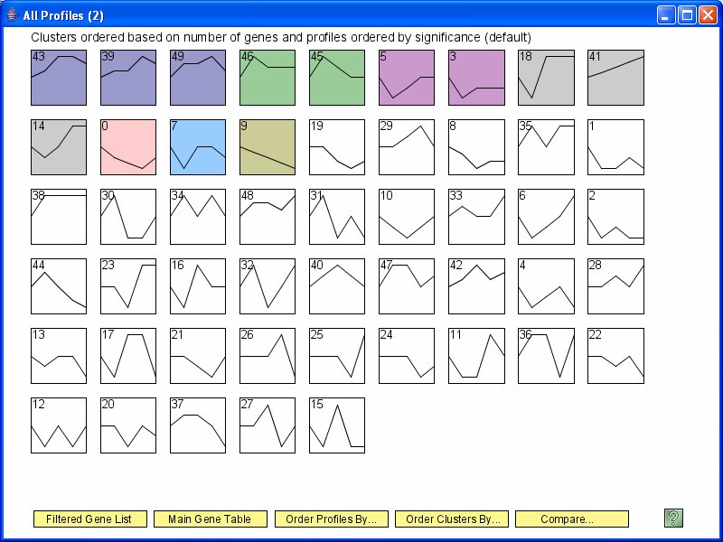
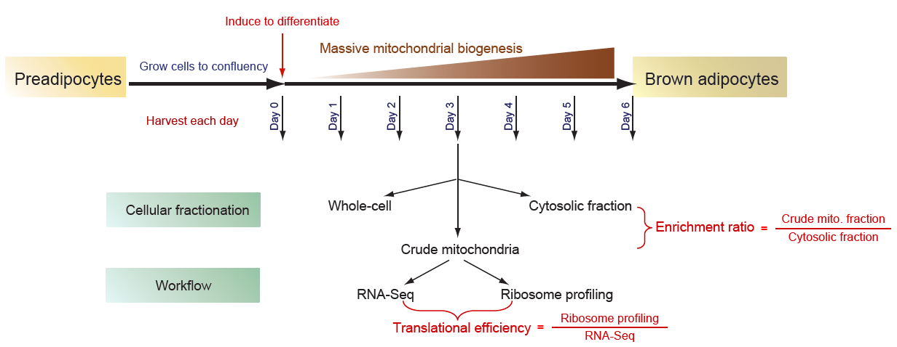
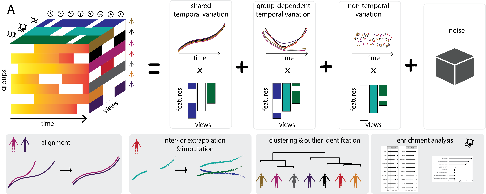
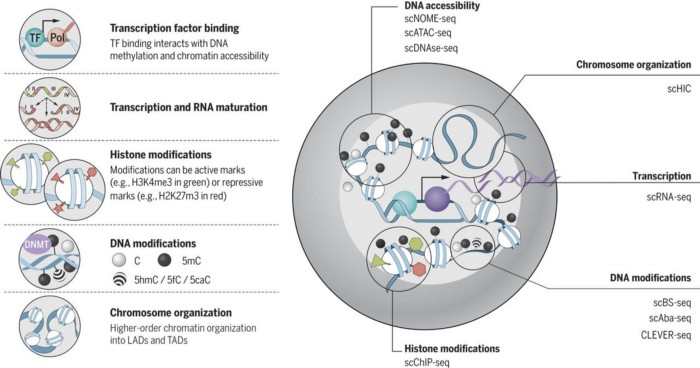
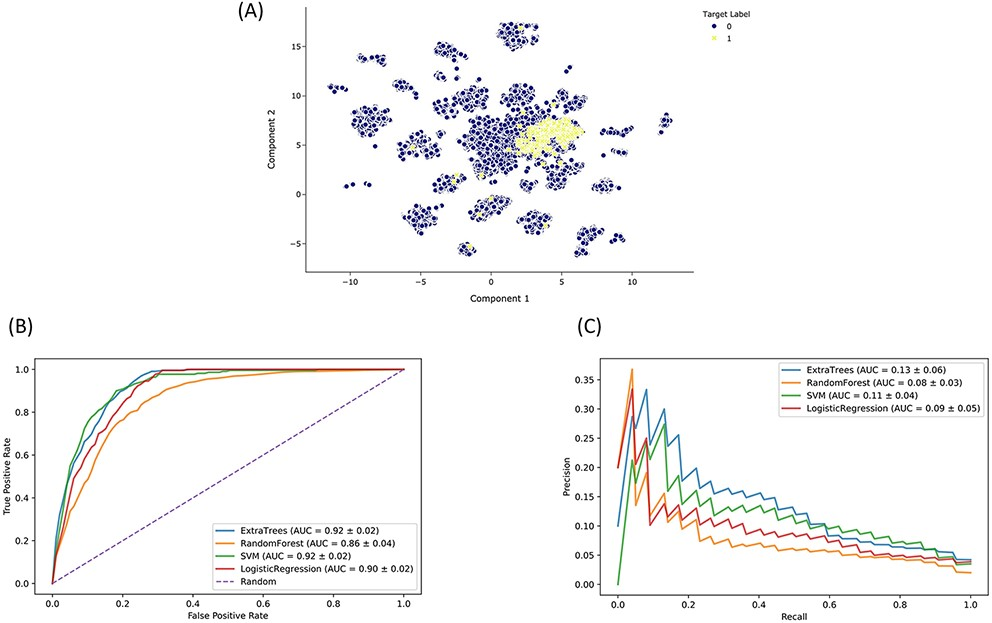
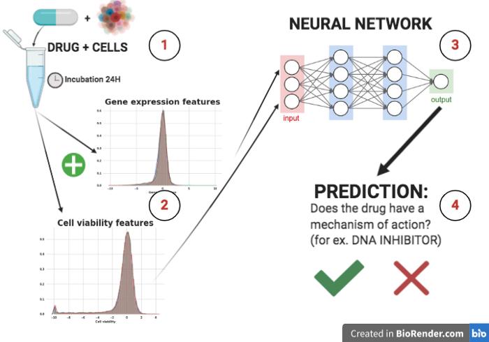
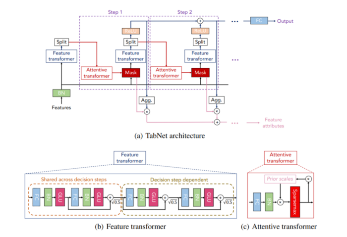
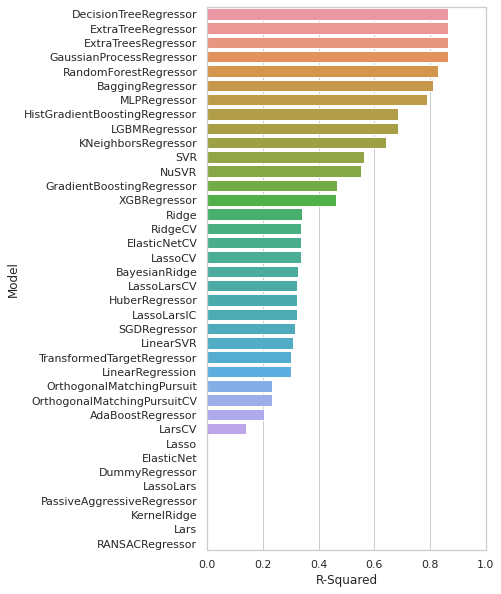
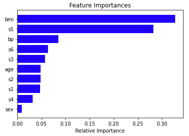

# Portfolio
---

## Bioinformatics 
### Time-series Clustering Analysis

  In this project, I evaluated different clustering algorithms to draw meaningful patterns from short time-series genomics data. Popular algorithms such as K-Means, as well as specially-developed algorithm for short time-series such as [STEM](https://link.springer.com/article/10.1186/1471-2105-7-191) are analyzed. I observed that classical clustering algorithms still performed well for various distance measures except for euclidean distance, while STEM excludes many relevant genes. This study concludes that we can use STEM to get the optimal number of clusters and then use any of the classical clustering algorithms to cluster our time-series data.
  
  

---

### Spatio-temporal Analysis of Translational Regulation in Brown Fat Differentiation

Following up on my thesis above, I would like to discover any further temporal and spatial patterns of variation in the data. Specifically, I want to understand how genes are translationally regulated differently at the bulk level, cytosolic level and crude mitochondria level. 

  

  
Here, we use [MEFISTO](https://www.nature.com/articles/s41592-021-01343-9) (developed based on [MOFA](https://biofam.github.io/MOFA2/)) which is a powerful factor analysis model that has been effectively and widely used to model multi-modal genomics datasets in an unsupervised manner. Preliminary analysis shows that the factor analysis is able to point out different spatio-temporal variations that are able to distinguish the regulation at the different comparment.

  

---

### Autoencoder for Integration of Multi-omics Data

  Multi-omics data have recently gained popularity with the advancement of sequencing technologies and data acquisition. Each omic data represents an important layer in solving various biological problems. By integrating different omics data, we are able to gain novel information and useful insights that may not be seen when each -omic layer is analysed individually. Autoencoder is performed since it has a successful track record in finding accurate lower dimensional representation in many studies. 
  
  

  
  In this analysis, I explored 2 multi-omics technologies: [CITEseq](https://www.nature.com/articles/nmeth.4380) and [scNMTseq](https://www.nature.com/articles/s41467-018-03149-4) which provide two and three levels of omics information, respectively. Using Autoencoder, it can be observed that the integration allows us to observe certain clusters identity that would be hard to identify using one type of omics alone.

  

---

## Computational Drug Discovery

---

### Predicting Drug's Attributes from Published Perturbation Studies and Small Molecule Features

  I explored and integrated various published datasets in order to discover effective drug(s) or small molecule(s) as autophagy inducers, particularly through TFEB activation. This pipeline is adapted from [Drugmonizome-ML](https://appyters.maayanlab.cloud/Drugmonizome_ML/) which has incorporated extensive databases on drugs and small molecules. I also streamlined the pipeline and modify it to compare different models easily. With this comprehensive pipeline, I hope to identify a list of drugs and relevant attributes that can be tested further in a much shorter time as compared to manually reading published papers for drug identification.
  
  

  
---

### Predicting Drug Mechanism of Action (MOA) using TabNet and Deep Neural Network

This [Kaggle's Competition](https://www.kaggle.com/c/lish-moa) coincides nicely with my current project on Drug Discovery. Here, I investigated various exploratory data analysis steps, while featuring engineering methods and ML algorithms from top performing Kagglers. TabNet expectedly performs well and takes less training time as compared to Deep Neural Network. By using this optimal model to predict a drug's Mechanism of Action, I hope to discover suitable drugs that act on the Transcription Factor EB (TFEB) to induce autophagy. 

  

  

---

### Supervised Regression models of Acetylcholinesterase Inhibitors

  This project is adapted from [Data Professor's Data Science Project](https://github.com/dataprofessor/bioinformatics_freecodecamp) where multiple regression models are evaluated to predict the activity of different acetylcholinesterase inhibitors. Data is obtained from [ChEMBL Database](https://www.ebi.ac.uk/chembl/) where a sizeable and curated bioactivity database of > 2 million compounds is present. Suprisingly, Decision Tree performs better than Random Forest or XGBoost that have been outperforming many models. Further investigation on the data and feature engineering need to be done in order to find out why this is the case.
  
  

  
---
## Miscellaneous

### Applying Classical Machine Learning for Popular Biological Data

  This exploratory project aims to investigate how Supervised ML can be applied to various biological problems. Both Classification and Regression tasks are explored here. Classical ML algorithms such as KNN, SVM and Random Forest are evaluated for this study. There are 3 mini tasks for this project: 

1) Classification of Breast Cancer Data

2) Regression Diabetest Patient Data

3) Cancer Classification based on Gene Expression

  

---

### Credit Fraud Prediction

  In this class project, my group studied various machine learning algorithms applied to the clasical application of machine learning, predicting credit frauds. Surprisingly, decision tree classifiers (which typically have a higher tendency to overfit) seem to perform better against robust ensemble methods such as Random Forest or AdaBoost. We hypothesised that this happens due to the bias present in the datasets. Here, we proposed some suggestions to overcome this bias, particularly on dealing with imbalanced data.

---

### Breaking Down Bias Statistic to Systematic and Unsystematic Risk

  
  For my first internship project, I applied Regression Analysis on a commonly used risk forecast' metric called Bias Statistic. Bias statistic helps to determine the accuracy of risk forecast of a certain portfolio model. This project aims to investigate whether it is possible to break down this metric into known risk components: Systematic Risk and Unsystematic Risk. This will then allow us to determine which component(s) of the portfolio has a higher contribution in causing the model to underpredict or overpredict risk. The analysis shows that it is indeed possible to break down the Bias Statistic into the two distinct risk components.
  
---

Powered by Jekyll and the Minimal Theme.

